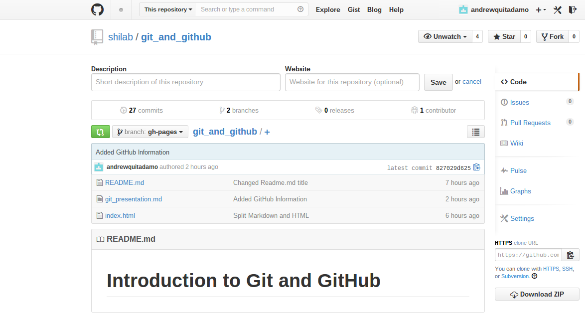

class: center, middle

# An Introduction to Git and GitHub

Andrew Quitadamo

---

# Overview

*   What is Git?

--

*  What is GitHub?

--

*  Git Basics

--
*  Collaborating on GitHub

---
name: git

# What is Git?  

*  Git is a Distributed Version Control System  

--

*  It tracks changes to files and stores them  

--

*  It allows you to revert file changes, view differences in file versions

---
# Where to get Git

*  [Git Download](http://git-scm.com/downloads)

*  [Git GUI Clients](http://git-scm.com/downloads/guis)

---

name: GitHub

# What is GitHub

*  GitHub is a web based repository host for Git.  

--

*  GitHub adds a web-based interface for Git. 

--

*  It adds functionality like forking, and pull requests which contribute to a collaborative model.

---

# Git Basics

*  To create a new repository, cd into the directory and type:
```
git init
```

--

*  You can also clone a remote repository, like the one this presentation is on:
```
git clone https://github.com/shilab/git_and_github.git
```

--

*  To add files for git to track:
```
git add <file>
```

--

*  To commit the file to the repository:
```
git commit -m 'Commit message'
```
The commit message details what you have changed. 

---

# Git Basics

* Update your local repository
```
git pull
```

--

* To see the status of the files in the repository:
```
git status
```

--

*  To see the repository history
```
git -log
```
--

* You can push the changes back to GitHub:
```
git push origin <branch>
```
Where ```<branch>``` is the branch you are working from.

---

# Git Branches

*  Branches can be used to isolate changes.  

--

*  The master branch is the default branch, and new branches can be created from it.

--

*  You can use a branch for developing a feature and then merge it back into the master branch.

--

*  To create a branch:  
```
git checkout -b <new_branch>
```

--

*  Switch back to master:
```
git checkout master
```

---

#Getting Started on GitHub

*  If you don't have an account you can sign up at [GitHub](https://github.com/)

--

*  With a .edu email address you can get 5 free private repos [GitHub Education](https://education.github.com/)

--

*  Our lab GitHub account is at https://github.com/shilab


---
#Collaborating on GitHub - GitHub Flow

* Create a branch 

--

* Code and commit

--

* Create Pull Request

--

* Discuss changes/Review code 
---

#Collaborating on GitHub - The Repo



---
#Collaborating on GitHub - Creating Branches

 

---

#Collaborating on GitHub - Creating Pull Requests


--


---

# Things that make GitHub worth using

*  [Issues tracking and Milestones](https://guides.github.com/features/issues/)

*  [Code as citable objects](https://guides.github.com/activities/citable-code/)

*  Pull Requests

*  Its a place to publish our code that people can easily access. 

*  GitHub pages

*  The collaboration model

---

# Resources

*  [Pro Git](http://git-scm.com/book)

*  [Software Carpentry Git & GitHub Lesson](http://software-carpentry.org/v5/novice/git/index.html)

*  [Collaboration on GitHub](https://help.github.com/articles/using-pull-requests)

*  [GitHub Flow](https://guides.github.com/introduction/flow/index.html)

*  [GitHub Guides](https://guides.github.com/)

